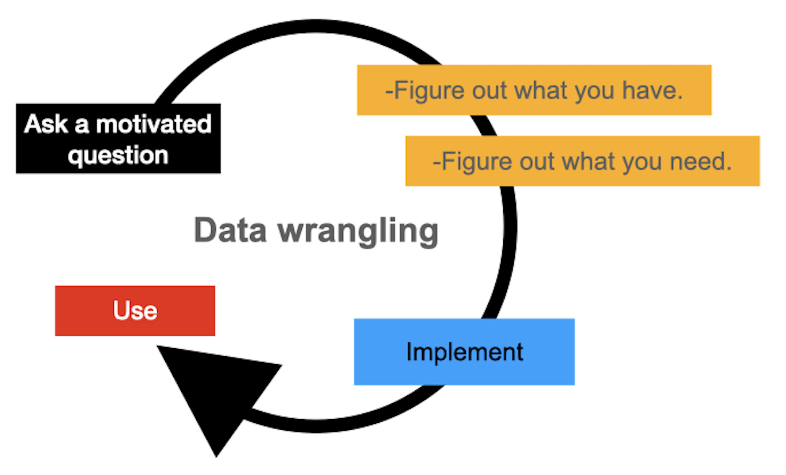

# The Art of Wrangling: Web-based Eye-tracking in Language Research

## *Reference:*
 Bramlett, A. A. & Wiener, S. (2024). The Art of Wrangling: Working with Web-based Eye-tracking Data in Language Research. *Linguistic Approaches to Bilingualism*.

## Additional Resources
For further details and resources related to this project, please visit the following link: [Open Science Framework- Project Repository](https://osf.io/a3e5s/?view_only=822c5f28422444768729f5342fd16848).

## Overview
This project offers a comprehensive guide for conducting eye-tracking studies in psycholinguistics through web-based methods. It focuses on making research accessible and reproducible, targeting bilingualism and multilingualism studies.

## Key Features
- **Framework for Reproducible Science**: Instructions for designing and analyzing eye-tracking studies.
  
  
- **Data Wrangling Guide**: Preparing eye-tracking data with R for analysis.
  
  
- **Best Practices**: Ensuring quality data collection and experimental design.

  
- **Open-Science Tools**: Emphasizing the use of R for data analysis. [Gorilla experiment modules]([https://osf.io/a3e5s/?view_only=822c5f28422444768729f5342fd16848](https://app.gorilla.sc/openmaterials/715241)).
  
   

- **Shiny Applications**: Frame-rate and Eye-fixation removal
  - **Frame-rate**: These visuals aim to assist the reader in understanding the relationship between frame rate as a metric to capture effects in the VWP.
    - [Link to Frame-rate Shiny App GitHub Repository](https://github.com/AdamAnderB/Frame_Rate_App)
  - **Signal and Noise with Eye-fixations**: These visuals aim to help the reader build an understanding of the relationship between removing data and retaining the signal.
    - [Link to Signal and Noise Shiny App GitHub Repository](https://github.com/AdamAnderB/Eye_Fixations_App)
      
- **Paper**: This is an earlier draft of the paper before the editing process when we were just getting started.

## Getting Started
1. **Installation**: Set up your environment with R and the necessary packages.
2. **Running Experiments**: Design your study and ensure data quality.
3. **Data Analysis**: Analyze your data in R, from data wrangling to statistical modeling. Following along with our main script: AOW_r_work_flow.Rmd

## Contributing
Contributions are welcome! Feel free to report bugs, improve documentation, or suggest new features through issues or pull requests.

## Citation
Please cite our paper if this framework assists in your research.
